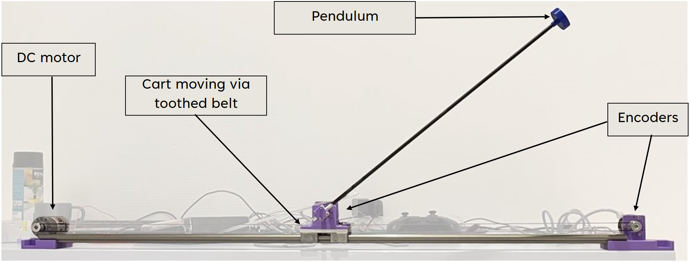
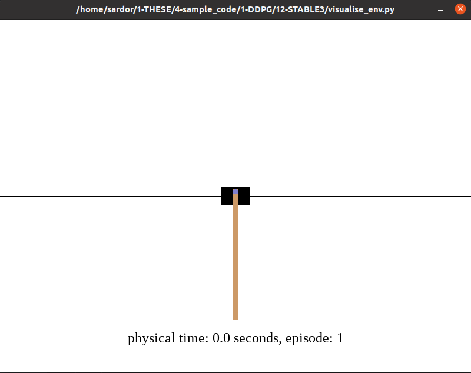

# Cart Pole
The article: [PLOS ONE](https://journals.plos.org/plosone/article?id=10.1371/journal.pone.0280071)



DQN, PPO, SAC for real/simulated cart-pole problem.
The parameters are optimized using Optuna library.

Simulation based on real-setup parameters and model.


*To generate the simulation of different parameters*
```bibtex
python EJPH/generate_data.py
```
*To plot the simulation results of different parameters*
```bibtex
python EJPH/plots.py
```
## cart-pole agent-environement interaction
rpi_control for environement interface of PC and raspberry pi
written in python/c++

If you want c++ server/client with python client, you can use [this](https://github.com/francofusco/pendule_pi).
Also, tutorials and examples are available in [this]([this](https://github.com/francofusco/pendule_pi)) repository.

The video of installation and deep RL (DQN) control is [here](https://www.youtube.com/watch?v=XMn1FI9_f8k&t=1s&ab_channel=SardorIsrailov)

LQR with Lyapunov-based swing-up is [here](https://www.youtube.com/watch?v=BAzXTSYR5ug&ab_channel=SardorIsrailov)

